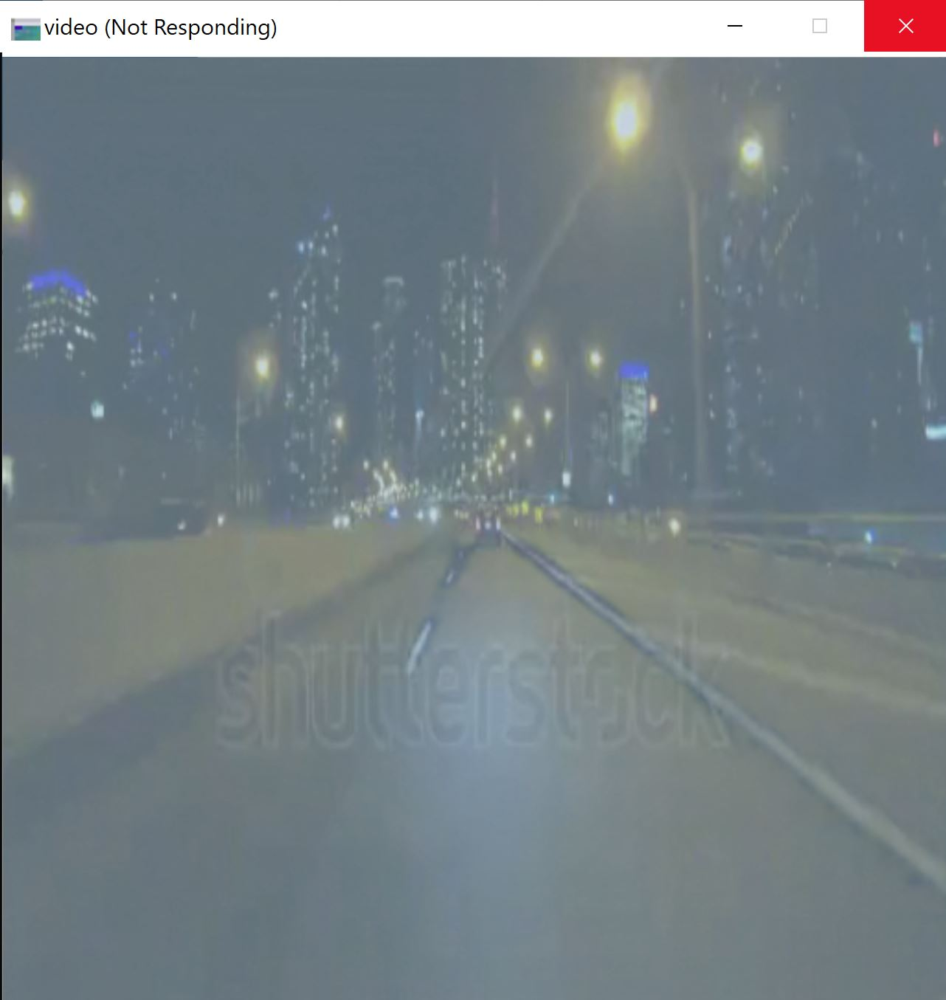

# lane_prediction
The tool to detect the lanes from videos

## Project Structure

Repo

    ├──main.cpp
    ├── opencv
    │   └── build
    ├── libtorch
    ├── videos
    │   └── driving.mp4
    ├── models
    │   └── lanes.pt       
    └── iamges


## How to add OpenCV to the project

The following [link](https://docs.opencv.org/4.x/d3/d52/tutorial_windows_install.html) includes the instrcutions of adding OpenCV into Windows.


## How to run the project

```bash
mkdir build
cd build 
cmake ..
cmake --build .
```

## The following images shows the running lane detection in a video

